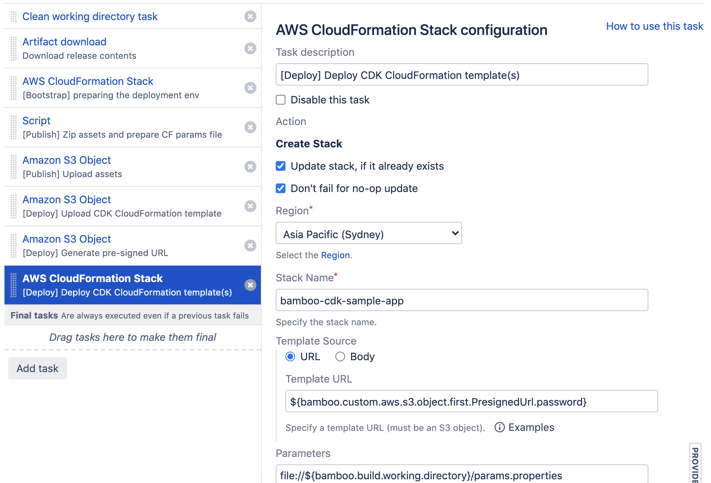

# bamboo-sample-cdk-app

## Overview
The project explains how to build a pipeline to deploy CDK apps using Atlassian Bamboo pipeline given the below constraints:
- Deployment needs to be done using CloudFormation

The benefit of this approach is that it gives greater control over the pipeline stages described in this [RFC](https://github.com/aws/aws-cdk-rfcs/blob/master/text/0049-continuous-delivery.md). However using CDK is much simpler. A typical CDK pipeline would have the following steps:
1. cdk synth for generating CloudFormation stacks
2. cdk bootstrap for creating resources required by CDK to deploy in new accounts
3. cdk-assets to publish assets (note: cdk-assets is still experimental)
4. cdk deploy --app cdk.out to deploy

## CDK app
This repo contains a sample CDK application that creates the following resources:
1. SQS Queue
2. SNS Topic
3. S3 Bucket
4. Lambda Function 

The Lambda Function code is an [asset](https://docs.aws.amazon.com/cdk/latest/guide/assets.html) that needs to be built, published (uploaded to S3). 

Please note that the app is written in Typescript and Lambda function uses NodeJS 10.

The repo also contains sample Bamboo build and deployment plans (Java specs) which will be described below
- Bamboo-Java-Specs-Build-Plan.java
- Bamboo-Java-Specs-Deployment-Plan.java

## Bamboo Build Plan

The build plan has 3 main tasks:

1. Source Code Checkout

2. AWS Credential Variables

3. Script task will basically call cdk synth

```
npm install typescript
cdk synth
```

`cdk synth` will automatically build Lambda Function included in the app and create an asset folder for each Lambda function in the default output folder **cdk.out** which I have added to the build plan artefacts.
Please note I am using an agent that has all build dependencies installed.
If you have specific requirements to build your Lambda Function, you can use [Bundling Asset Code](https://docs.aws.amazon.com/cdk/api/latest/docs/aws-lambda-readme.html#bundling-asset-code) feature that allows bundling Lambda code by running a command in a docker container. 


## Bamboo Deploy Project

Deployment plan tasks:

1. Clean working directory task

2. Artifact download: that is basically *cdk.out* directory

3. AWS CloudFormation Stack: which will bootstrap the deployment environment by creating the required deployment resources. That is basically what `cdk bootstrap` would do to prepare the environment for deploying assets -- for more details check [CDK CLI](https://docs.aws.amazon.com/cdk/latest/guide/cli.html). In this step, I basically create an S3 bucket that will be used to upload generated CloudFormation templates and assets (Lambda Function code) in the following steps.

4. Script: reads all assets from **manifest.json** file, zip their folders and generates a CloudFormation parameters files. The script will be found in file `publish.sh` in this repo.

5. Amazon S3 Object: Publishes or uploads all assets to the deployment S3 bucket.

6. Amazon S3 Object: Uploads the CloudFormation template to the deployment S3 bucket. Please note that this step can be merged with the above one. However, I serparated them to make a clear distinction between Publish and Deploy stages. Publish stage is scoped to steps 4 and 5, while deployment starts from this step.

7. Amazon S3 Object: generates a pre-signed URL of the CloudFormation stack template because AWS CloudFormation Stack accepts only public URL.

8. AWS CloudFormation Stack: deploys the CloudFormation template. Configuration are show below

